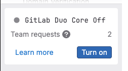



- Offering: GitLab Self-Managed



To ensure GitLab Duo is configured properly and can connect to GitLab:

- You must ensure both outbound and inbound connectivity exists. Network firewalls can cause lag or delay.
- [Silent Mode](../../administration/silent_mode/_index.md) must not be turned on.
- You must [activate your instance with an activation code](../../administration/license.md#activate-gitlab-ee).
  You cannot use an [offline license](https://about.gitlab.com/pricing/licensing-faq/cloud-licensing/#what-is-an-offline-cloud-license) or a legacy license.
- You should use GitLab 17.2 and later for the best results. Earlier versions might continue to work, however the experience may be degraded.

GitLab Duo features that are experimental or beta are turned off by default
and [must be turned on](../../user/gitlab_duo/turn_on_off.md#turn-on-beta-and-experimental-features).

## Allow outbound connections from the GitLab instance

 Check both your outbound and inbound settings:

- Your firewalls and HTTP/S proxy servers must allow outbound connections
  to `cloud.gitlab.com` and `customers.gitlab.com` on port `443` both with `https://`.
  These hosts are protected by Cloudflare. Update your firewall settings to allow traffic to
  all IP addresses in the [list of IP ranges Cloudflare publishes](https://www.cloudflare.com/ips/).
- To use an HTTP/S proxy, both `gitLab_workhorse` and `gitLab_rails` must have the necessary
  [web proxy environment variables](https://docs.gitlab.com/omnibus/settings/environment-variables.html) set.
- In multi-node GitLab installations, configure the HTTP/S proxy on all **Rails** and **Sidekiq** nodes.

## Allow inbound connections from clients to the GitLab instance

- GitLab instances must allow inbound connections from Duo clients ([IDEs](../../editor_extensions/_index.md),
  Code Editors, and GitLab Web Frontend) on port 443 with `https://` and `wss://`.
- Both `HTTP2` and the `'upgrade'` header must be allowed, because GitLab Duo
  uses both REST and WebSockets.
- Check for restrictions on WebSocket (`wss://`) traffic to `wss://gitlab.example.com/-/cable` and other `.com` domains.
  Network policy restrictions on `wss://` traffic can cause issues with some GitLab Duo Chat
  services. Consider policy updates to allow these services.
- If you use reverse proxies, such as Apache, you might see GitLab Duo Chat connection issues in your
  logs, like **WebSocket connection to .... failures**.

To resolve this problem, try editing your Apache proxy settings:

```apache
# Enable WebSocket reverse Proxy
# Needs proxy_wstunnel enabled
  RewriteCond %{HTTP:Upgrade} websocket [NC]
  RewriteCond %{HTTP:Connection} upgrade [NC]
  RewriteRule ^/?(.*) "ws://127.0.0.1:8181/$1" [P,L]
```

## Run a health check for GitLab Duo



- Status: Beta





- [Introduced](https://gitlab.com/gitlab-org/gitlab/-/merge_requests/161997) in GitLab 17.3.
- [Download health check report added](https://gitlab.com/gitlab-org/gitlab/-/merge_requests/165032) in GitLab 17.5.



You can determine if your instance meets the requirements to use GitLab Duo.
When the health check completes, it displays a pass or fail result and the types of issues.
If the health check fails any of the tests, users might not be able to use GitLab Duo features in your instance.

This is a [beta](../../policy/development_stages_support.md) feature.

Prerequisites:

- You must be an administrator.

To run a health check:

1. On the left sidebar, at the bottom, select **Admin**.
1. Select **GitLab Duo**.
1. On the upper-right corner, select **Run health check**.
1. Optional. In GitLab 17.5 and later, after the health check is complete, you can select **Download report** to save a detailed report of the health check results.

These tests are performed:

| Test | Description |
|-----------------|-------------|
| Network | Tests whether your instance can connect to `customers.gitlab.com` and `cloud.gitlab.com`.<br><br>If your instance cannot connect to either destination, ensure that your firewall or proxy server settings [allow connection](setup.md). |
| Synchronization | Tests whether your subscription: <br>- Has been activated with an activation code and can be synchronized with `customers.gitlab.com`.<br>- Has correct access credentials.<br>- Has been synchronized recently. If it hasn't or the access credentials are missing or expired, you can [manually synchronize](../../subscriptions/manage_subscription.md#manually-synchronize-subscription-data) your subscription data. |
| System exchange | Tests whether Code Suggestions can be used in your instance. If the system exchange assessment fails, users might not be able to use GitLab Duo features. |

For GitLab instances earlier than version 17.10, if you are encountering any issues with the health check,
see the [troubleshooting page](../../user/gitlab_duo/troubleshooting.md).

## Other hosting options

By default, GitLab Duo uses supported AI vendor language models and sends data through a cloud-based AI gateway that's hosted by GitLab.

If you want to host your own language models or AI gateway:

- You can [use GitLab Duo Self-Hosted to host the AI gateway and use any of the supported self-hosted models](../../administration/gitlab_duo_self_hosted/_index.md#self-hosted-ai-gateway-and-llms).
  This option provides full control over your data and security.
- Use a [hybrid configuration](../../administration/gitlab_duo_self_hosted/_index.md#hybrid-ai-gateway-and-model-configuration),
  where you host your own AI gateway and models for some features, but configure other features to use the GitLab AI gateway and vendor models.

## Hide sidebar widget that shows GitLab Duo Core availability

On the left sidebar, near the bottom, a widget shows the availability of GitLab Duo
Core.
To hide this widget, disable the `duo_agent_platform_widget_self_managed` feature flag.


