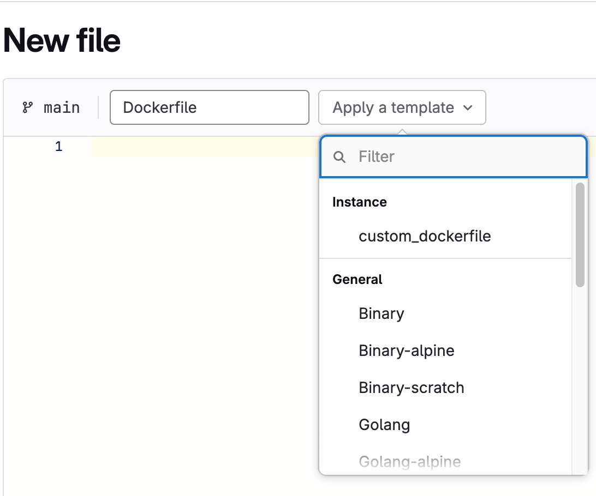



- Tier: Premium, Ultimate
- Offering: GitLab Self-Managed



In hosted systems, enterprises often have a need to share their own templates
across teams. This feature allows an administrator to pick a project to be the
instance-wide collection of file templates. These templates are then exposed to
all users through the [Web Editor](../../user/project/repository/web_editor.md)
while the project remains secure.

## Configuration

To select a project to serve as the custom template repository:

1. On the left sidebar, at the bottom, select **Admin**.
1. Select **Settings > Templates**.
1. Expand **Templates**
1. From the dropdown list, select the project to use as the template repository.
1. Select **Save changes**.
1. Add custom templates to the selected repository.

After you add templates, you can use them for the entire instance.
They are available in the [Web Editor](../../user/project/repository/web_editor.md)
and through the [API settings](../../api/settings.md).

These templates cannot be used as a value of the
[`include:template`](../../ci/yaml/_index.md#includetemplate) key in `.gitlab-ci.yml`.

## Supported file types and locations

GitLab supports Markdown files for issue and merge request templates and other file type templates.

The following Markdown description templates are supported:

| Type               | Directory                         | Extension         |
| :---------------:  | :-----------:                     | :-----------:     |
| Issue              | `.gitlab/issue_templates`         | `.md`             |
| Merge request      | `.gitlab/merge_request_templates` | `.md`             |

For more information, see [description templates](../../user/project/description_templates.md).

Other supported file type templates include:

| Type                    | Directory            | Extension     |
| :---------------:       | :-----------:        | :-----------: |
| `Dockerfile`            | `Dockerfile`         | `.dockerfile` |
| `.gitignore`            | `gitignore`          | `.gitignore`  |
| `.gitlab-ci.yml`        | `gitlab-ci`          | `.yml`        |
| `LICENSE`               | `LICENSE`            | `.txt`        |

Each template must be in its respective subdirectory, have the correct
extension, and not be empty. The hierarchy should look like this:

```plaintext
|-- README.md
    |-- issue_templates
        |-- feature_request.md
    |-- merge_request_templates
        |-- default.md
|-- Dockerfile
    |-- custom_dockerfile.dockerfile
    |-- another_dockerfile.dockerfile
|-- gitignore
    |-- custom_gitignore.gitignore
    |-- another_gitignore.gitignore
|-- gitlab-ci
    |-- custom_gitlab-ci.yml
    |-- another_gitlab-ci.yml
|-- LICENSE
    |-- custom_license.txt
    |-- another_license.txt
```

Your custom templates are displayed in the dropdown list when a new file is added through the GitLab UI:



If this feature is disabled or no templates are present,
no **Custom** section displays in the selection dropdown list.
