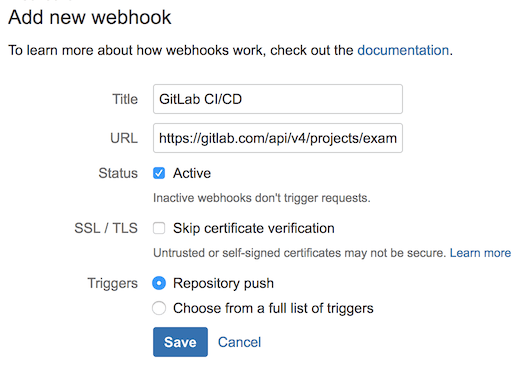



- Tier: Premium, Ultimate
- Offering: GitLab.com, GitLab Self-Managed, GitLab Dedicated



GitLab CI/CD can be used with Bitbucket Cloud by:

1. Creating a [CI/CD project](_index.md).
1. Connecting your Git repository by URL.

To use GitLab CI/CD with a Bitbucket Cloud repository:

1. In Bitbucket, create an [**App password**](https://support.atlassian.com/bitbucket-cloud/docs/create-an-app-password/) to authenticate
   the script that sets commit build
   statuses in Bitbucket. Repository write permissions are required.

   

1. In Bitbucket, from your repository, select **Clone**, then copy the URL that starts after `git clone`.

1. In GitLab, create a project:

   1. On the left sidebar, at the top, select **Create new** () and **New project/repository**.
   1. Select **Run CI/CD for external repository**.
   1. Select **Repository by URL**.
   1. Complete the fields:
      - For **Git repository URL**, enter the URL of your Bitbucket repository. Make sure to remove your `@username`.
      - For **Username**, enter the username associated with the App password.
      - For **Password**, enter the App password from Bitbucket.

   GitLab imports the repository and enables [Pull Mirroring](../../user/project/repository/mirror/pull.md).
   You can check that mirroring is working in the project in **Settings > Repository > Mirroring repositories**.

1. In GitLab, create a
   [personal access token](../../user/profile/personal_access_tokens.md)
   with `api` scope. The token is used to authenticate requests from the web
   hook that is created in Bitbucket to notify GitLab of new commits.

1. In Bitbucket, from **Settings > Webhooks**, create a new webhook to notify
   GitLab of new commits.

   The webhook URL should be set to the GitLab API to trigger pull mirroring,
   using the personal access token we just generated for authentication.

   ```plaintext
   https://gitlab.example.com/api/v4/projects/:project_id/mirror/pull?private_token=<your_personal_access_token>
   ```

   The webhook trigger should be set to **Repository Push**.

   

   After saving, test the webhook by pushing a change to your Bitbucket
   repository.

1. In GitLab, from **Settings > CI/CD > Variables**, add variables to allow
   communication with Bitbucket through the Bitbucket API:

   - `BITBUCKET_ACCESS_TOKEN`: The Bitbucket app password created previously. This variable should be [masked](../variables/_index.md#mask-a-cicd-variable).
   - `BITBUCKET_USERNAME`: The username of the Bitbucket account.
   - `BITBUCKET_NAMESPACE`: Set this variable if your GitLab and Bitbucket namespaces differ.
   - `BITBUCKET_REPOSITORY`: Set this variable if your GitLab and Bitbucket project names differ.

1. In Bitbucket, add a script that pushes the pipeline status to Bitbucket. The script
   is created in Bitbucket, but the mirroring process copies it to the GitLab mirror. The GitLab
   CI/CD pipeline runs the script, and pushes the status back to Bitbucket.

   Create a file `build_status`, insert the following script and run
   `chmod +x build_status` in your terminal to make the script executable.

   ```shell
   #!/usr/bin/env bash

   # Push GitLab CI/CD build status to Bitbucket Cloud

   if [ -z "$BITBUCKET_ACCESS_TOKEN" ]; then
      echo "ERROR: BITBUCKET_ACCESS_TOKEN is not set"
   exit 1
   fi
   if [ -z "$BITBUCKET_USERNAME" ]; then
       echo "ERROR: BITBUCKET_USERNAME is not set"
   exit 1
   fi
   if [ -z "$BITBUCKET_NAMESPACE" ]; then
       echo "Setting BITBUCKET_NAMESPACE to $CI_PROJECT_NAMESPACE"
       BITBUCKET_NAMESPACE=$CI_PROJECT_NAMESPACE
   fi
   if [ -z "$BITBUCKET_REPOSITORY" ]; then
       echo "Setting BITBUCKET_REPOSITORY to $CI_PROJECT_NAME"
       BITBUCKET_REPOSITORY=$CI_PROJECT_NAME
   fi

   BITBUCKET_API_ROOT="https://api.bitbucket.org/2.0"
   BITBUCKET_STATUS_API="$BITBUCKET_API_ROOT/repositories/$BITBUCKET_NAMESPACE/$BITBUCKET_REPOSITORY/commit/$CI_COMMIT_SHA/statuses/build"
   BITBUCKET_KEY="ci/gitlab-ci/$CI_JOB_NAME"

   case "$BUILD_STATUS" in
   running)
      BITBUCKET_STATE="INPROGRESS"
      BITBUCKET_DESCRIPTION="The build is running!"
      ;;
   passed)
      BITBUCKET_STATE="SUCCESSFUL"
      BITBUCKET_DESCRIPTION="The build passed!"
      ;;
   failed)
      BITBUCKET_STATE="FAILED"
      BITBUCKET_DESCRIPTION="The build failed."
      ;;
   esac

   echo "Pushing status to $BITBUCKET_STATUS_API..."
   curl --request POST "$BITBUCKET_STATUS_API" \
   --user $BITBUCKET_USERNAME:$BITBUCKET_ACCESS_TOKEN \
   --header "Content-Type:application/json" \
   --silent \
   --data "{ \"state\": \"$BITBUCKET_STATE\", \"key\": \"$BITBUCKET_KEY\", \"description\":
   \"$BITBUCKET_DESCRIPTION\",\"url\": \"$CI_PROJECT_URL/-/jobs/$CI_JOB_ID\" }"
   ```

1. In Bitbucket, create a `.gitlab-ci.yml` file to use the script to push
   pipeline success and failures to Bitbucket. Similar to the script added previously,
   this file is copied to the GitLab repository as part of the mirroring process.

   ```yaml
   stages:
     - test
     - ci_status

   unit-tests:
     script:
       - echo "Success. Add your tests!"

   success:
     stage: ci_status
     before_script:
       - ""
     after_script:
       - ""
     script:
       - BUILD_STATUS=passed BUILD_KEY=push ./build_status
     when: on_success

   failure:
     stage: ci_status
     before_script:
       - ""
     after_script:
       - ""
     script:
       - BUILD_STATUS=failed BUILD_KEY=push ./build_status
     when: on_failure
   ```

GitLab is now configured to mirror changes from Bitbucket, run CI/CD pipelines
configured in `.gitlab-ci.yml` and push the status to Bitbucket.
