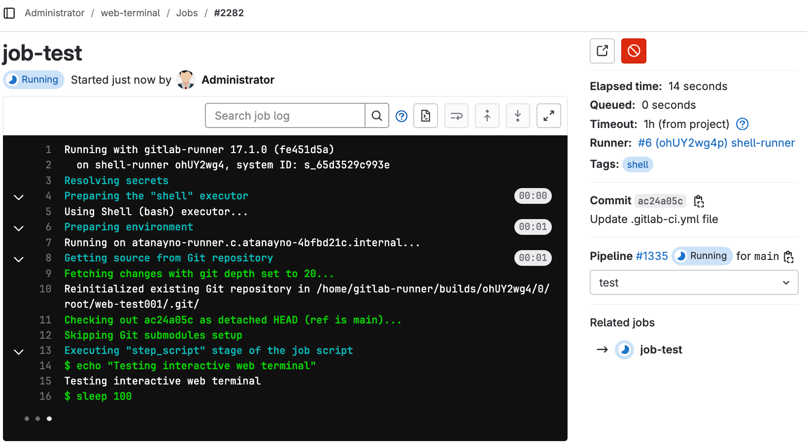
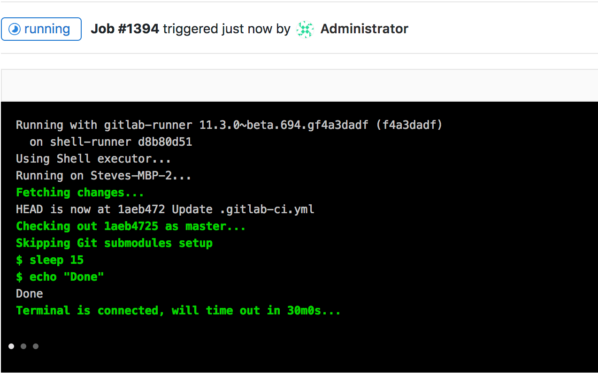



- Tier: Free, Premium, Ultimate
- Offering: GitLab.com, GitLab Self-Managed, GitLab Dedicated



Interactive web terminals give the user access to a terminal in GitLab for
running one-off commands for their CI pipeline. You can think of it like a method for
debugging with SSH, but done directly from the job page. Because this is giving the user
shell access to the environment where [GitLab Runner](https://docs.gitlab.com/runner/)
is deployed, some [security precautions](../../administration/integration/terminal.md#security) were
taken to protect the users.



[Instance runners on GitLab.com](../runners/_index.md) do not
provide an interactive web terminal. Follow
[this issue](https://gitlab.com/gitlab-org/gitlab/-/issues/24674) for progress on
adding support. For groups and projects hosted on GitLab.com, interactive web
terminals are available when using your own group or project runner.



## Configuration

Two things need to be configured for the interactive web terminal to work:

- The runner needs to have
  [`[session_server]` configured properly](https://docs.gitlab.com/runner/configuration/advanced-configuration.html#the-session_server-section)
- If you are using a reverse proxy with your GitLab instance, web terminals need to be
  [enabled](../../administration/integration/terminal.md#enabling-and-disabling-terminal-support)

### Partial support for Helm chart

Interactive web terminals are partially supported in `gitlab-runner` Helm chart.
They are enabled when:

- The number of replica is one
- You use the `loadBalancer` service

Support for fixing these limitations is tracked in the following issues:

- [Support of more than one replica](https://gitlab.com/gitlab-org/charts/gitlab-runner/-/issues/323)
- [Support of more service types](https://gitlab.com/gitlab-org/charts/gitlab-runner/-/issues/324)

## Debugging a running job



Not all executors are
[supported](https://docs.gitlab.com/runner/executors/#compatibility-chart).





The `docker` executor does not keep running
after the build script is finished. At that point, the terminal automatically
disconnects and does not wait for the user to finish. Follow
[this issue](https://gitlab.com/gitlab-org/gitlab-runner/-/issues/3605) for updates on
improving this behavior.


Sometimes, when a job is running, things don't go as you expect. It
would be helpful if one can have a shell to aid debugging. When a job runs,
the right panel displays a `debug` button () that opens the terminal
for the current job. Only the person who started a job can debug it.

When selected, a new tab opens to the terminal page where you can access
the terminal and type commands like in a standard shell.

If your terminal is open after the job completes,
the job doesn't finish until after the configured
[`[session_server].session_timeout`](https://docs.gitlab.com/runner/configuration/advanced-configuration.html#the-session_server-section)
duration. To avoid this, you can close the terminal after the job finishes.

