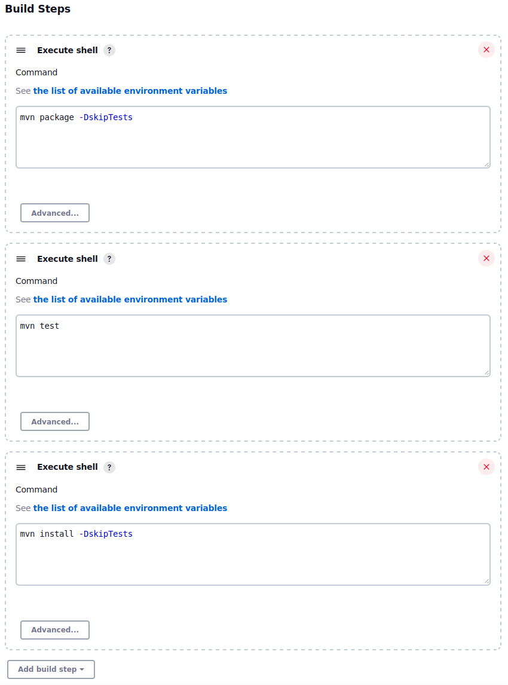
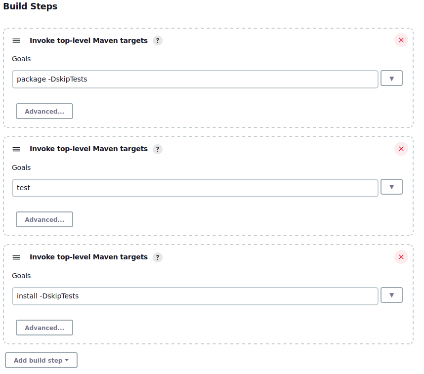

# Migrate a Maven build from Jenkins to GitLab CI/CD

DETAILS:
**Tier:** Free, Premium, Ultimate
**Offering:** GitLab.com, GitLab Self-Managed, GitLab Dedicated

If you have a Maven build in Jenkins, you can use a [Java Spring](https://gitlab.com/gitlab-org/project-templates/spring)
project template to migrate to GitLab. The template uses Maven for its underlying dependency management.

## Sample Jenkins configurations

The following three Jenkins examples each use different methods to test, build, and install a
Maven project into a shell agent:

- Freestyle with shell execution
- Freestyle with the Maven task plugin
- A declarative pipeline using a Jenkinsfile

All three examples run the same three commands in order, in three different stages:

- `mvn test`: Run any tests found in the codebase
- `mvn package -DskipTests`: Compile the code into an executable type defined in the POM
  and skip running any tests because that was done in the first stage.
- `mvn install -DskipTests`: Install the compiled executable into the agent's local Maven
  `.m2` repository and again skip running the tests.

These examples use a single, persistent Jenkins agent, which requires Maven to be
pre-installed on the agent. This method of execution is similar to a GitLab Runner
using the [shell executor](https://docs.gitlab.com/runner/executors/shell.html).

### Freestyle with shell execution

If using Jenkins' built-in shell execution option to directly call `mvn` commands
from the shell on the agent, the configuration might look like:



### Freestyle with Maven task plugin

If using the Maven plugin in Jenkins to declare and execute any specific goals
in the [Maven build lifecycle](https://maven.apache.org/guides/introduction/introduction-to-the-lifecycle.html),
the configuration might look like:



This plugin requires Maven to be installed on the Jenkins agent, and uses a script wrapper
for calling Maven commands.

### Using a declarative pipeline

If using a declarative pipeline, the configuration might look like:

```groovy
pipeline {
    agent any
    tools {
        maven 'maven-3.6.3'
        jdk 'jdk11'
    }
    stages {
        stage('Build') {
            steps {
                sh "mvn package -DskipTests"
            }
        }
        stage('Test') {
            steps {
                sh "mvn test"
            }
        }
        stage('Install') {
            steps {
                sh "mvn install -DskipTests"
            }
        }
    }
}
```

This example uses shell execution commands instead of plugins.

By default, a declarative pipeline configuration is stored either in the Jenkins
pipeline configuration or directly in the Git repository in a `Jenksinfile`.

## Convert Jenkins configuration to GitLab CI/CD

While the examples above are all slightly different, they can all be migrated to GitLab CI/CD
with the same pipeline configuration.

Prerequisites:

- A GitLab Runner with a Shell executor
- Maven 3.6.3 and Java 11 JDK installed on the shell runner

This example mimics the behavior and syntax of building, testing, and installing on Jenkins.

In a GitLab CI/CD pipeline, the commands run in "jobs", which are grouped into stages.
The migrated configuration in the `.gitlab-ci.yml` configuration file consists of
two global keywords (`stages` and `variables`) followed by 3 jobs:

```yaml
stages:
  - build
  - test
  - install

variables:
  MAVEN_OPTS: >-
    -Dhttps.protocols=TLSv1.2
    -Dmaven.repo.local=$CI_PROJECT_DIR/.m2/repository
  MAVEN_CLI_OPTS: >-
    -DskipTests

build-JAR:
  stage: build
  script:
    - mvn $MAVEN_CLI_OPTS package

test-code:
  stage: test
  script:
    - mvn test

install-JAR:
  stage: install
  script:
    - mvn $MAVEN_CLI_OPTS install
```

In this example:

- `stages` defines three stages that run in order. Like the Jenkins examples above,
  the test job runs first, followed by the build job, and finally the install job.
- `variables` defines [CI/CD variables](../../variables/_index.md) that can be used by all jobs:
  - `MAVEN_OPTS` are Maven environment variables needed whenever Maven is executed:
    - `-Dhttps.protocols=TLSv1.2` sets the TLS protocol to version 1.2 for any HTTP requests in the pipeline.
    - `-Dmaven.repo.local=$CI_PROJECT_DIR/.m2/repository` sets the location of the
      local Maven repository to the GitLab project directory on the runner, so the job
      can access and modify the repository.
  - `MAVEN_CLI_OPTS` are specific arguments to be added to `mvn` commands:
    - `-DskipTests` skips the `test` stage in the Maven build lifecycle.
- `test-code`, `build-JAR`, and `install-JAR` are the user-defined names for the jobs
  to run in the pipeline:
  - `stage` defines which stage the job runs in. A pipeline contains one or more stages
    and a stage contains one or more jobs. This example has three stages, each with a single job.
  - `script` defines the commands to run in that job, similar to `steps` in a `Jenkinsfile`.
    Jobs can run multiple commands in sequence, which run in the image container,
    but in this example the jobs run only one command each.

### Run jobs in Docker containers

Instead of using a persistent machine for handling this build process like the Jenkins samples,
this example uses an ephemeral Docker container to handle execution. Using a container
removes the need for maintaining a virtual machine and the Maven version installed on it.
It also increases flexibility for expanding and extending the functionality of the pipeline.

Prerequisites:

- A GitLab Runner with the Docker executor that can be used by the project.
  If you are using GitLab.com, you can use the public instance runners.

This migrated pipeline configuration consists of three global keywords (`stages`, `default`, and `variables`)
followed by 3 jobs. This configuration makes use of additional GitLab CI/CD features
for an improved pipeline compared to the [example above](#convert-jenkins-configuration-to-gitlab-cicd):

```yaml
stages:
  - build
  - test
  - install

default:
  image: maven:3.6.3-openjdk-11
  cache:
    key: $CI_COMMIT_REF_SLUG
    paths:
      - .m2/

variables:
  MAVEN_OPTS: >-
    -Dhttps.protocols=TLSv1.2
    -Dmaven.repo.local=$CI_PROJECT_DIR/.m2/repository
  MAVEN_CLI_OPTS: >-
    -DskipTests

build-JAR:
  stage: build
  script:
    - mvn $MAVEN_CLI_OPTS package

test-code:
  stage: test
  script:
    - mvn test

install-JAR:
  stage: install
  script:
    - mvn $MAVEN_CLI_OPTS install
```

In this example:

- `stages` defines three stages that run in order. Like the Jenkins examples above,
  the test job runs first, followed by the build job, and finally the install job.
- `default` defines standard configuration to reuse in all jobs by default:
  - `image` defines the Docker image container to use and execute commands in. In this example,
    it's an official Maven Docker image with everything needed already installed.
  - `cache` is used to cache and reuse dependencies:
    - `key` is the unique identifier for the specific cache archive. In this example,
      it's a shortened version of the Git commit ref, autogenerated as a [predefined CI/CD variable](../../variables/predefined_variables.md).
      Any job that runs for the same commit ref reuses the same cache.
    - `paths` are the directories or files to include in the cache. In this example,
      we cache the `.m2/` directory to avoid re-installing dependencies between job runs.
- `variables` defines [CI/CD variables](../../variables/_index.md) that can be used by all jobs:
  - `MAVEN_OPTS` are Maven environment variables needed whenever Maven is executed:
    - `-Dhttps.protocols=TLSv1.2` sets the TLS protocol to version 1.2 for any HTTP requests in the pipeline.
    - `-Dmaven.repo.local=$CI_PROJECT_DIR/.m2/repository` sets the location of the
      local Maven repository to the GitLab project directory on the runner, so the job
      can access and modify the repository.
  - `MAVEN_CLI_OPTS` are specific arguments to be added to `mvn` commands:
    - `-DskipTests` skips the `test` stage in the Maven build lifecycle.
- `test-code`, `build-JAR`, and `install-JAR` are the user-defined names for the jobs
  to run in the pipeline:
  - `stage` defines which stage the job runs in. A pipeline contains one or more stages
    and a stage contains one or more jobs. This example has three stages, each with a single job.
  - `script` defines the commands to run in that job, similar to `steps` in a `Jenkinsfile`.
    Jobs can run multiple commands in sequence, which run in the image container,
    but in this example the jobs run only one command each.
