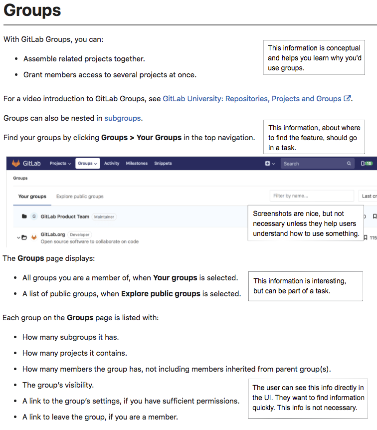
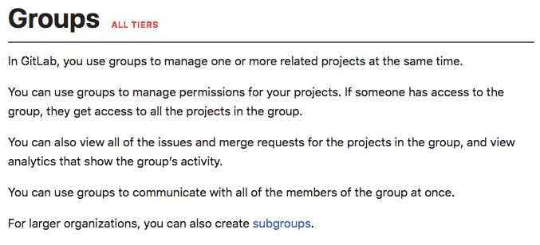

A concept introduces a single feature or concept.

A concept should answer the questions:

- **What** is this?
- **Why** would you use it?

Think of everything someone might want to know if they've never heard of this concept before.

Don't tell them **how** to do this thing. Tell them **what it is**.

If you start describing another concept, start a new concept and link to it.

## Format

Concepts should be in this format:

```markdown
title: Title (a noun, like "Widgets")
---

A paragraph or two that explains what this thing is and why you would use it.

If you start to describe another concept, stop yourself.
Each concept should be about **one concept only**.

If you start to describe **how to use the thing**, stop yourself.
Task topics explain how to use something, not concept topics.

Do not include links to related tasks. The navigation provides links to tasks.
```

## Concept topic titles

For the title text, use a noun. For example:

- `Widgets`
- `GDK dependency management`

If you need more descriptive words, use the `ion` version of the word, rather than `ing`. For example:

- `Object migration` instead of `Migrating objects` or `Migrate objects`

Words that end in `ing` are hard to translate and take up more space, and active verbs are used for task topics.
For details, see [the Google style guide](https://developers.google.com/style/headings#heading-and-title-text).

### Titles to avoid

Avoid these topic titles:

- `Overview` or `Introduction`. Instead, use a more specific
  noun or phrase that someone would search for.
- `Use cases`. Instead, incorporate the information as part of the concept.
- `How it works`. Instead, use a noun followed by `workflow`. For example, `Merge request workflow`.

## Example

### Before

The following topic was trying to be all things to all people. It provided information about groups
and where to find them. It reiterated what was visible in the UI.



### After

The information is easier to scan if you move it into concepts and [tasks](task.md).

#### Concept



#### Task


