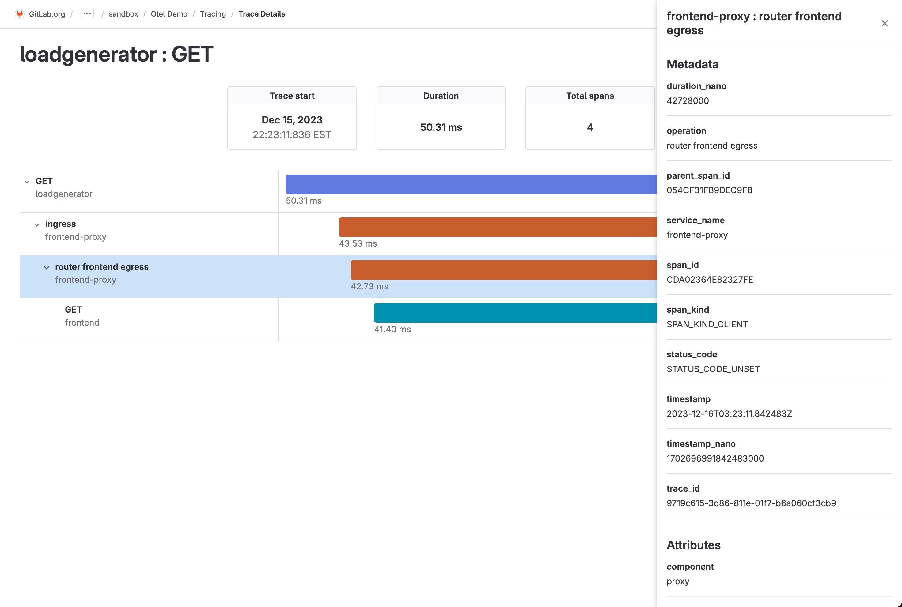



- Tier: Ultimate
- Offering: GitLab.com, GitLab Self-Managed
- Status: Beta





This feature is not under active development.





- [Introduced](https://gitlab.com/gitlab-org/gitlab/-/merge_requests/124966) in GitLab 16.2 [with a flag](../administration/feature_flags/_index.md) named `observability_tracing`. Disabled by default. This feature is in [beta](../policy/development_stages_support.md#beta).
- Feature flag [changed](https://gitlab.com/gitlab-org/gitlab/-/merge_requests/158786) in GitLab 17.3 to the `observability_features` [feature flag](../administration/feature_flags/_index.md), disabled by default. The previous feature flag `observability_tracing` was removed.
- [Introduced](https://gitlab.com/groups/gitlab-org/opstrace/-/epics/100) for GitLab Self-Managed in GitLab 17.3.
- [Changed](https://gitlab.com/gitlab-com/marketing/digital-experience/buyer-experience/-/issues/4198) to internal beta in GitLab 17.7.





The availability of this feature is controlled by a feature flag.
For more information, see the history.
This feature is available for testing, but not ready for production use.



With distributed tracing, you can troubleshoot application performance issues by inspecting how a request moves through different services and systems, the timing of each operation, and any errors or logs as they occur. Tracing is particularly useful in the context of microservice applications, which group multiple independent services collaborating to fulfill user requests.

This feature is in [beta](../policy/development_stages_support.md). For more information, see the [group direction page](https://about.gitlab.com/direction/monitor/platform-insights/). To leave feedback about tracing bugs or functionality, comment in the [feedback issue](https://gitlab.com/gitlab-org/opstrace/opstrace/-/issues/2590) or open a [new issue](https://gitlab.com/gitlab-org/opstrace/opstrace/-/issues/new).

## Tracing ingestion limits

Tracing ingests a maximum of 102,400 bytes per minute.
When the limit is exceeded, a `429 Too Many Requests` response is returned.

To request a limit increase to 1,048,576 bytes per minute, contact [GitLab support](https://about.gitlab.com/support/).

## Data retention

GitLab retains all traces for 30 days.

## Configure distributed tracing for a project

Configure distributed tracing to enable it for a project.

Prerequisites:

- You must have at least the Maintainer role for the project.

1. Create an access token:
   1. On the left sidebar, select **Search or go to** and find your project.
   1. Select **Settings** > **Access tokens**.
   1. Create an access token with the `api` scope and **Developer** role or greater.
      Save the access token value for later.
1. To configure your application to send GitLab traces, set the following environment variables:

   ```shell
   OTEL_EXPORTER = "otlphttp"
   OTEL_EXPORTER_OTLP_ENDPOINT = "https://gitlab.example.com/api/v4/projects/<gitlab-project-id>/observability/"
   OTEL_EXPORTER_OTLP_HEADERS = "PRIVATE-TOKEN=<gitlab-access-token>"
   ```

   Use the following values:

   - `gitlab.example.com` - The hostname for your GitLab Self-Managed instance, or `gitlab.com`
   - `gitlab-project-id` - The project ID.
   - `gitlab-access-token` - The access token you created

When your application is configured, run it, and the OpenTelemetry exporter attempts to send
traces to GitLab.

## View your traces

If your traces are exported successfully, you can see them in the project.

To view the list of traces:

1. On the left sidebar, select **Search or go to** and find your project.
1. Select **Monitor > Traces**.
1. Optional. To view the details of a trace, select it from the list.

   

   The trace details page and a list of spans are displayed.

   

1. Optional. To view the attributes for a single span, select it from the list.

   

## Create an issue for a trace

You can create an issue to track any action taken to resolve or investigate a trace. To create an issue for a trace:

1. On the left sidebar, select **Search or go to** and find your project.
1. Select **Monitor > Traces**.
1. From the list of traces, select a trace.
1. Select **Create issue**.

The issue is created in the selected project and pre-filled with information from the trace.
You can edit the issue title and description.

## View issues related to a trace

1. On the left sidebar, select **Search or go to** and find your project.
1. Select **Monitor > Traces**.
1. From the list of traces, select a trace.
1. Scroll to **Related issues**.
1. Optional. To view the issue details, select an issue.
