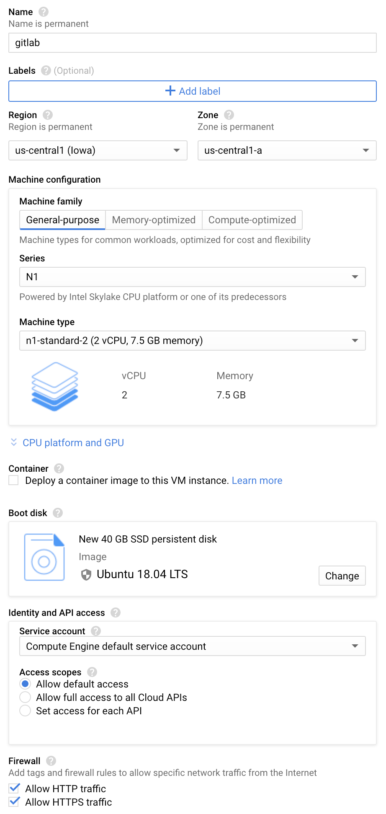
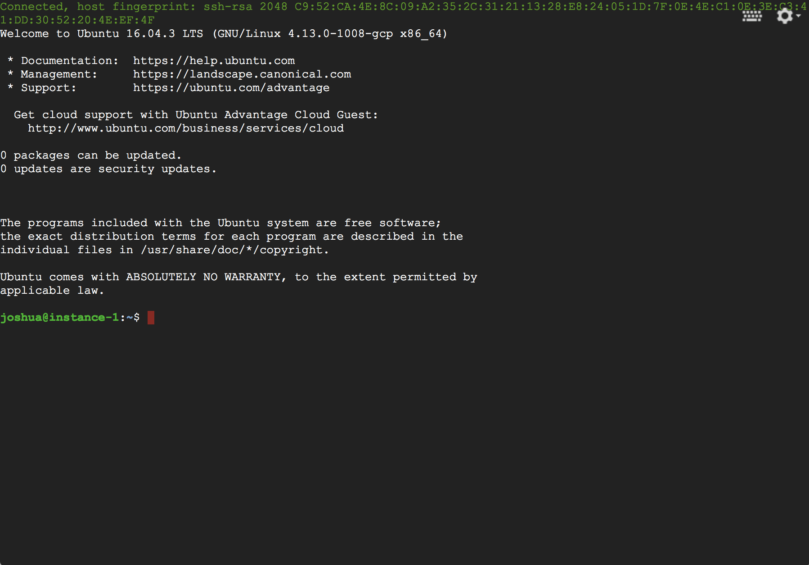
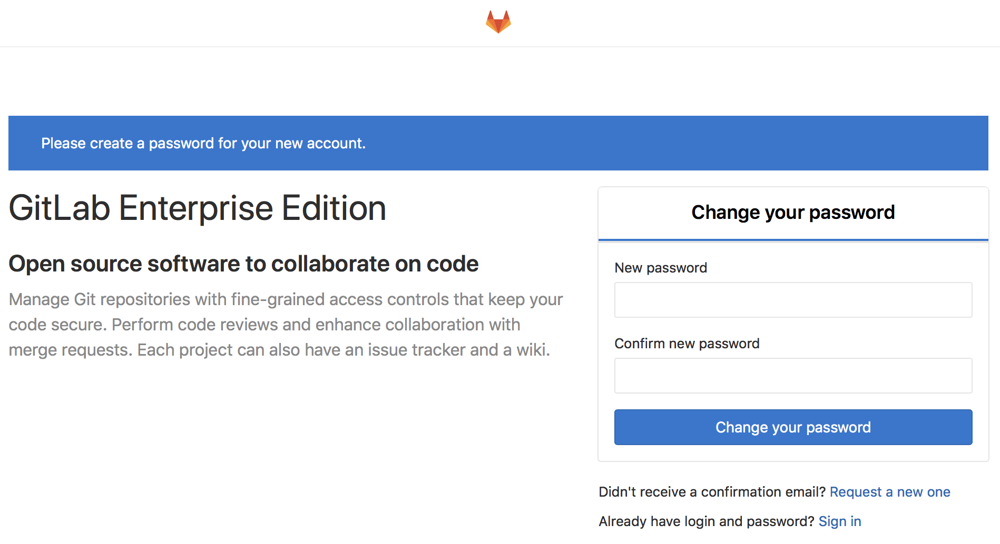

DETAILS:
**Tier:** Free, Premium, Ultimate
**Offering:** GitLab Self-Managed

You can install GitLab on a [Google Cloud Platform (GCP)](https://cloud.google.com/) using the official Linux package. You should customize it to accommodate your needs.

NOTE:
To deploy production-ready GitLab on
Google Kubernetes Engine,
you can follow Google Cloud Platform's
[`Click to Deploy` steps](https://github.com/GoogleCloudPlatform/click-to-deploy/blob/master/k8s/gitlab/README.md)
It's an alternative to using a GCP VM, and uses
the [Cloud native GitLab Helm chart](https://docs.gitlab.com/charts/).

## Prerequisites

There are two prerequisites to install GitLab on GCP:

1. You must have a Google account.
1. You must sign up for the GCP program. If this is your first time, Google
   gives you [$300 credit for free](https://console.cloud.google.com/freetrial) to consume over a 60-day period.

After you have performed those two steps, you can [create a VM](#creating-the-vm).

## Creating the VM

To deploy GitLab on GCP you must create a virtual machine:

1. Go to <https://console.cloud.google.com/compute/instances> and sign in with your Google credentials.
1. Select **Create**

   

1. On the next page, you can select the type of VM as well as the
   estimated costs. Provide the name of the instance, desired data center, and machine type.
   Note our [hardware requirements for different user base sizes](../requirements.md).

   

1. To select the size, type, and desired [operating system](../../administration/package_information/supported_os.md),
   select **Change** under `Boot disk`. select **Select** when finished.

1. As a last step allow HTTP and HTTPS traffic, then select **Create**. The process finishes in a few seconds.

## Installing GitLab

After a few seconds, the instance is created and available to sign in. The next step is to install GitLab onto the instance.


1. Make a note of the external IP address of the instance, as you will need that in a later step. <!-- using future tense is okay here -->
1. Select **SSH** under the connect column to connect to the instance.
1. A new window appears, with you logged into the instance.

   

1. Next, follow the instructions for installing GitLab for the operating system you choose, at <https://about.gitlab.com/install/>. You can use the external IP address you noted before as the hostname.

1. Congratulations! GitLab is now installed and you can access it via your browser. To finish installation, open the URL in your browser and provide the initial administrator password. The username for this account is `root`.

   

## Next steps

These are the most important next steps to take after you installed GitLab for
the first time.

### Assigning a static IP

By default, Google assigns an ephemeral IP to your instance. It is strongly
recommended to assign a static IP if you are using GitLab in production
and use a domain name as shown below.

For more information, see [Promote an ephemeral external IP address](https://cloud.google.com/vpc/docs/reserve-static-external-ip-address#promote_ephemeral_ip).

### Using a domain name

Assuming you have a domain name in your possession and you have correctly
set up DNS to point to the static IP you configured in the previous step,
here's how you configure GitLab to be aware of the change:

1. SSH into the VM. You can select **SSH** in the Google console
   and a new window pops up.

   

   In the future you might want to set up [connecting with an SSH key](https://cloud.google.com/compute/docs/connect/standard-ssh)
   instead.

1. Edit the configuration file of the Linux package using your favorite text editor:

   ```shell
   sudo vim /etc/gitlab/gitlab.rb
   ```

1. Set the `external_url` value to the domain name you wish GitLab to have
   **without** `https`:

   ```ruby
   external_url 'http://gitlab.example.com'
   ```

   We will set up HTTPS in the next step, no need to do this now. <!-- using future tense is okay here -->

1. Reconfigure GitLab for the changes to take effect:

   ```shell
   sudo gitlab-ctl reconfigure
   ```

1. You can now visit GitLab using the domain name.

### Configuring HTTPS with the domain name

Although not needed, it's strongly recommended to secure GitLab with a
[TLS certificate](https://docs.gitlab.com/omnibus/settings/ssl/).

### Configuring the email SMTP settings

You must configure the email SMTP settings correctly otherwise GitLab cannot send notification emails, like comments, and password changes.
Check the [Linux package documentation](https://docs.gitlab.com/omnibus/settings/smtp.html#smtp-settings) how to do so.

## Further reading

GitLab can be configured to authenticate with other OAuth providers, like LDAP,
SAML, and Kerberos. Here are some documents you might be interested in reading:

- [Linux package documentation](https://docs.gitlab.com/omnibus/)
- [Integration documentation](../../integration/_index.md)
- [GitLab Pages configuration](../../administration/pages/_index.md)
- [GitLab container registry configuration](../../administration/packages/container_registry.md)

<!-- ## Troubleshooting

Include any troubleshooting steps that you can foresee. If you know beforehand what issues
one might have when setting this up, or when something is changed, or on upgrading, it's
important to describe those, too. Think of things that may go wrong and include them here.
This is important to minimize requests for support, and to avoid doc comments with
questions that you know someone might ask.

Each scenario can be a third-level heading, for example `### Getting error message X`.
If you have none to add when creating a doc, leave this section in place
but commented out to help encourage others to add to it in the future. -->
