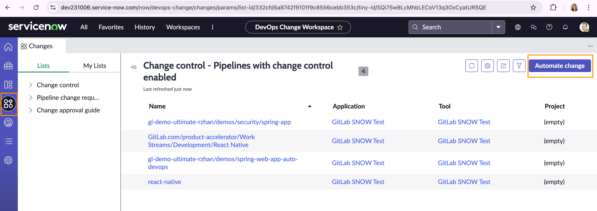
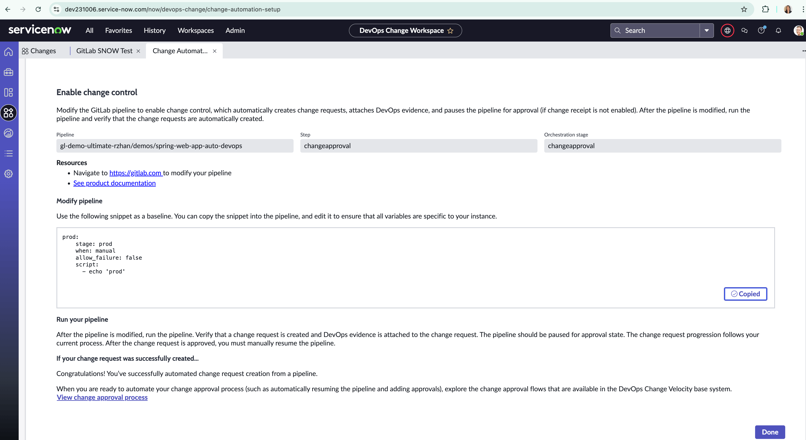
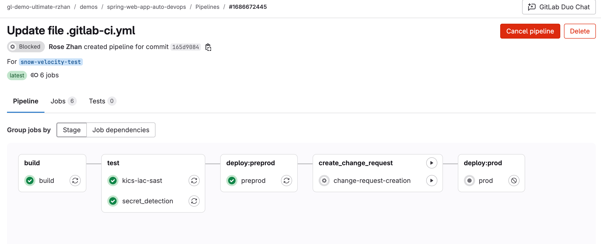
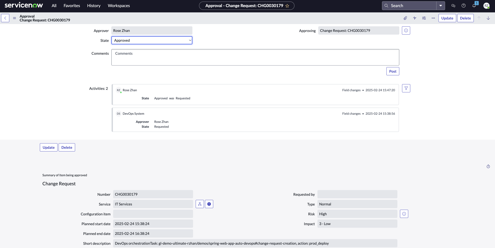
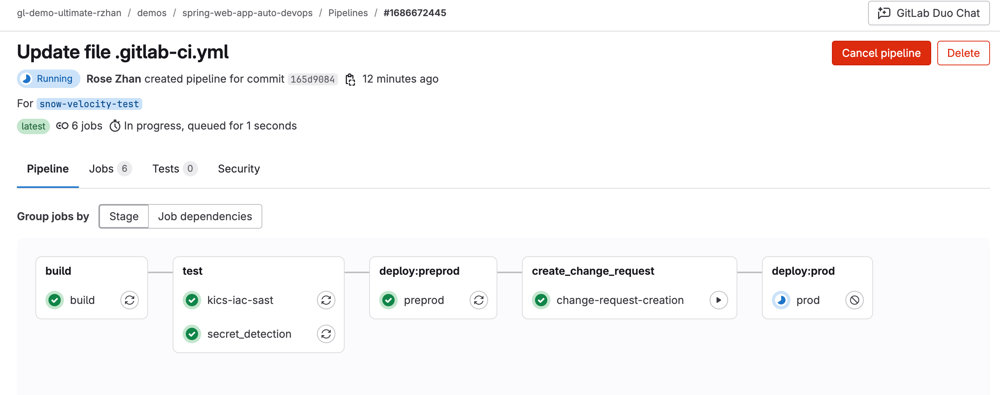
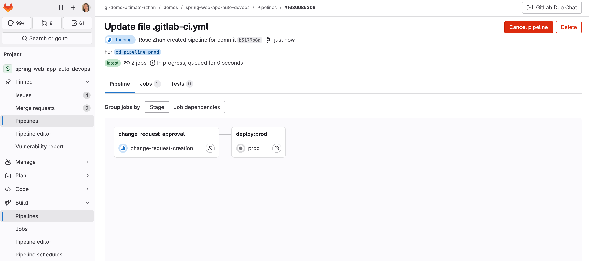
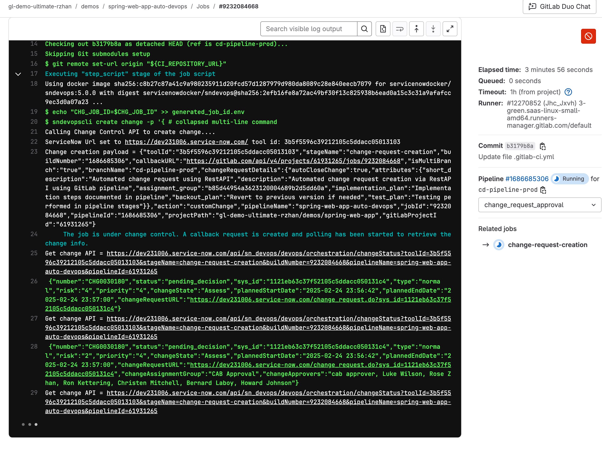
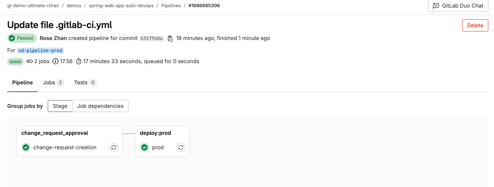



- Tier: Premium, Ultimate
- Offering: GitLab.com, GitLab Self-Managed, GitLab Dedicated
- ServiceNow Version: Latest version, Xanadu and backward compatibility with previous versions



This document provides the instruction and functional detail for GitLab to orcestrate the change management with integrated ServiceNow solution using ServiceNow DevOps Change Velocity.

With the ServiceNow DevOps Change Velocity integration, it's able to track information about activity in GitLab repositories and CI/CD pipelines in ServiceNow.

It automates the creation of change requests and automatically approve the change requests based on the policy critieria when it's integrated with GitLab CI/CD pipelines.

This document shows you how to 

1. Integrate ServiceNow with GitLab with Change Velocity for change management, 
1. Create in the GitLab CI/CD pipeline automatically the change request in ServiceNow,
1. Approve the change request in ServiceNow if it requires CAB review and approval,
1. Start the production deployment based on the change request approval.

## Getting Started

### Download the Solution Component

1. Obtain the invitation code from your account team.
1. Download the solution component from [the solution component webstore](https://cloud.gitlab-accelerator-marketplace.com) by using your invitation code.

## Integration Options for Change Management

There are multiple ways to integrate GitLab with ServiceNow. The followings options are provided in this solution component:

1. ServiceNow DevOps Change Velocity for Built-in Change Request Process
1. ServiceNow DevOps Change Velocity with Custom Change Request with Velocity Container Image
1. ServiceNow Rest API for custom Change Request Process

## ServiceNow DevOps Change Velocity

Upon installing and configuring DevOps Change Velocity from ServiceNow store, enable change control through automated change creation in the DevOps Change Workspace Directly. 

### Built-in Change Request Process

ServiceNow DevOps Change Velocity provides built-in change request model for normal change process and the change request created automatically has default naming convention.

The normal change process requires the change request to be approved before the deployment pipeline job to production can occur.

#### Setup the Pipeline and Change Request Jobs

Use the `gitlab-ci-workflow1.yml` sample pipeline in the solution repository as a starting point. 
Check below for the steps to enable the automatic change creation and pass the change attributes through the pipeline. 

Note: for more detailed instructions, please see [the ServiceNow documentation](https://www.servicenow.com/docs/bundle/yokohama-it-service-management/page/product/enterprise-dev-ops/task/automate-devops-change-request.html)

Below are the high-level steps:

1. From the DevOps Change Workspace, navigate to the Change tab, then select Automate change. 
1. In the Application field, select the application that you want to associate with the pipeline for which you want to automate change request creation, and select Next.
1. Select the pipeline that has the step (stage) from where you want to trigger the automated creation of change requests. For example, the change request creation step.
1. Select the step in the pipeline from where you want to trigger the automated creation of a change request.
1. Specify the change attributes in the change fields and enable change receipt by selecting the Change receipt option.
1. Modify your pipeline and use the corresponding code snippet to enable change control and specify change attributes. For example, adding the following two configurations to the job that has change control enabled:

   ```yaml
      when: manual
      allow_failure: false
   ```

    

#### Run Pipeline with Change Management

Once the above steps are completed, the project CD pipeline can incorporate the jobs illustrated in the `gitlab-ci-workflow1.yml` sample pipeline. Below are the Change Management steps: 

1. In ServiceNow, Change control is enabled for one of the stages in the pipeline. 
1. In GitLab, the pipeline job with the change control function runs. 
1. In ServiceNow, a change request is automatically created in ServiceNow. 
1. In ServiceNow, approve the change request 
    
1. Pipeline resumes and begins the next job for deploying to the production environment upon the approval of the change request. 
    

### Custom Actions with Velocity Container Image

Use the ServiceNow custom actions via the DevOps Change Velocity Docker image to set Change Request title, description, change plan, rollback plan, and data related to artifacts to be deployed, and package registration. This allows you to customize the change request descriptions instead of passing the pipeline metadata as the change request description. 

#### Setup the Pipeline and Change Request Jobs

Since this is add-on to the ServiceNow DevOps Change Velocity, the above setup steps are same. You just need to include the Docker image in the pipeline definition.

Use the `gitlab-ci-workflow2.yml` sample pipeline in this repository as an example.

1. Specify the image to use in the job. Please update the image version as needed.

   ```yaml
      image: servicenowdocker/sndevops:5.0.0
   ```

1. Use the CLI for specific actions. For example, to use the sndevops CLI to create a change request

   ```yaml
   sndevopscli create change -p {
        "changeStepDetails": {
          "timeout": 3600,
          "interval": 100
        },
        "autoCloseChange": true,
        "attributes": {
          "short_description": "'"${CHANGE_REQUEST_SHORT_DESCRIPTION}"'",
          "description": "'"${CHANGE_REQUEST_DESCRIPTION}"'",
          "assignment_group": "'"${ASSIGNMENT_GROUP_ID}"'",
          "implementation_plan": "'"${CR_IMPLEMENTATION_PLAN}"'",
          "backout_plan": "'"${CR_BACKOUT_PLAN}"'",
          "test_plan": "'"${CR_TEST_PLAN}"'"
        }
      }

   ```

#### Run Pipeline with Custom Change Management

Use the `gitlab-ci-workflow2.yml` sample pipeline as a starting point.
Once the above steps are completed, the project CD pipeline can incorporate the jobs illustrated in the `gitlab-ci-workflow2.yml` sample pipeline. Below are the Change Management steps: 

1. In ServiceNow, change control is enabled for one of the stages in the pipeline. 
1. In GitLab, the pipeline job with the change control function runs. 
1. In ServiceNow, a change request is created with custom title, description and any other fields supplied by the pipeline variable values using `servicenowdocker/sndevops` image. 
1. In GitLab, change request number and other information can be found in the pipeline details. The pipeline job will remain running until the change request is approved, then it will proceed to the next job. 
1. In ServiceNow, approve the change request.
    
1. In GitLab, the Pipeline job resumes and begins the next job which is the deployment to the production environment upon the approval of the change request. 
    
