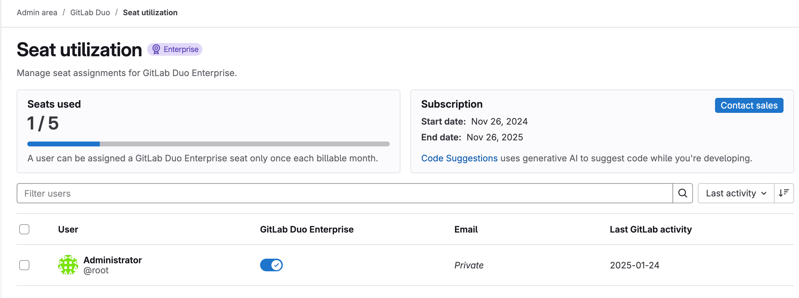
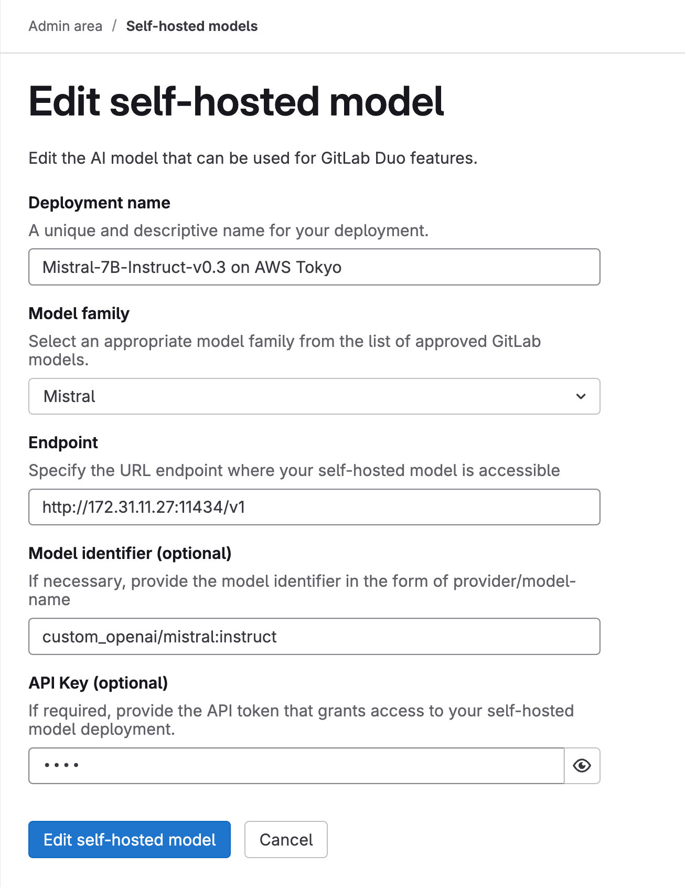
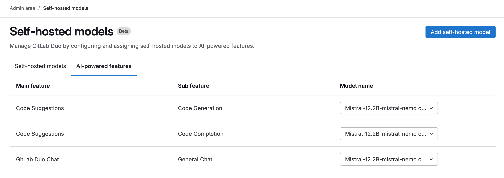
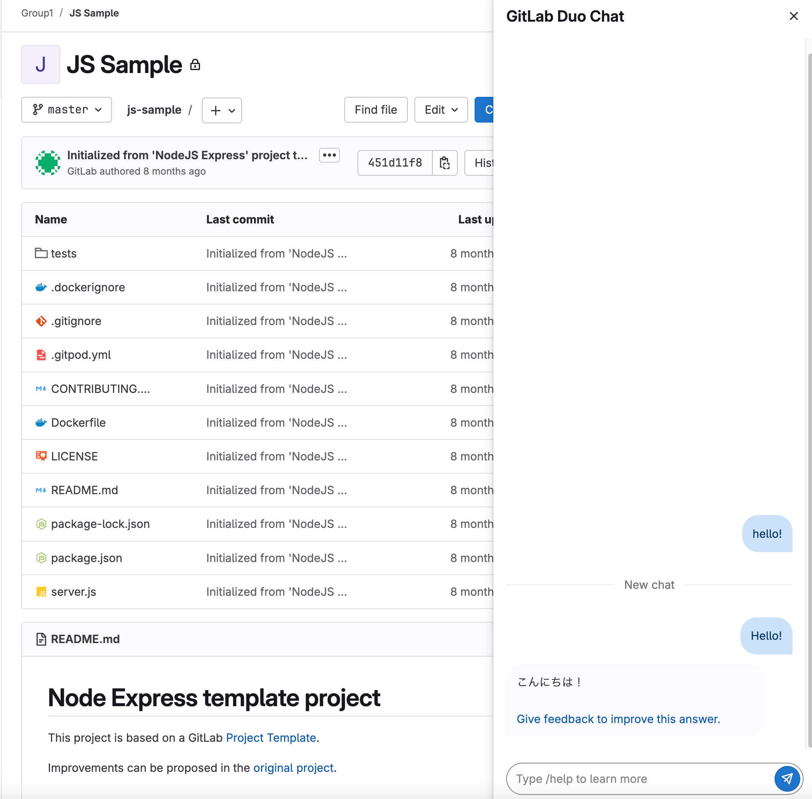



- Tier: Ultimate
- Add-on: GitLab Duo Pro or Enterprise
- Offering: GitLab Self-Managed



The document describes the installation and integration of GitLab and GitLab Duo with a self-hosted Large Language Model (LLM) running a Mistral model on Ollama. The guide describes the setup using 3 different
virtual machines and can be easily followed along on AWS or GCP. Of course, the process is applicable to different deployment platforms, too.

This guide is a comprehensive, end-to-end set of instructions for getting the desired setup working. It calls out references to the many areas of GitLab documentation that were used to support the creation of the final configuration. The referenced docs are important when more background is needed to adjust the implementation to a specific scenario.
<!-- TOC -->

- GitLab Duo Self-Hosted: Complete AWS/Google Cloud Deployment Guide with Ollama Integration
  - [Prerequisites](#prerequisites)
    - [Virtual Machines](#virtual-machines)
      - [Resources & Operating System](#resources--operating-system)
      - [Networking](#networking)
    - [GitLab](#gitlab)
      - [Licensing](#licensing)
      - [SSL/TLS](#ssltls)
- [Introduction](#introduction)
  - [Installation](#installation)
    - [AI Gateway](#ai-gateway)
    - [Ollama](#ollama)
      - [Installation](#installation)
      - [Model Deployment](#model-deployment)
  - [Integration](#integration)
    - [Enable GitLab Duo for Root User](#enable-gitlab-duo-for-root-user)
    - [Configure Self-Hosted Model in GitLab](#configure-gitlab-duo-self-hosted-in-gitlab)
  - [Verification](#verification)

<!-- /TOC -->

## Prerequisites

### Virtual Machines

#### Resources & Operating System

We will install GitLab, GitLab AI Gateway and Ollama each in their own separate virtual machine. While we used Ubuntu 24.0x in this guide, you have flexibility in choosing any Unix-based operating system that meets your organization's requirements and preferences. However, please note that using a Unix-based operating system is mandatory for this setup. This ensures system stability, security, and compatibility with the required software stack. This setup provides a good balance between cost and performance for testing and evaluation phases, though you may need to upgrade the GPU instance type when moving to production, depending on your usage requirements and team size.

|                | **GCP**       | **AWS**     | **OS**    | **Disk** |
|----------------|---------------|-------------|-----------|----------|
| **GitLab**     | c2-standard-4 | c6xlarge    | Ubuntu 24 | 50 GB    |
| **AI Gateway** | e2-medium     | t2.medium   | Ubuntu 24 | 20 GB    |
| **Ollama**     | n1-standard-4 | g4dn.xlarge | Ubuntu 24 | 50 GB    |

For details on the [AI Gateway](../../user/gitlab_duo/gateway.md) component and its purpose, please refer to the documentation page.

```mermaid
flowchart LR
    A[GitLab<br/>Ultimate] --> C
    C[GitLab<br/>AI Gateway] --> B[Ollama<br/>Mistral]
```

These components work together to realize the Self-Hosted AI functionality. This guide provides detailed instructions for building a complete self-hosted AI environment using Ollama as the LLM server.



While for a full production environment, the [official documentation](../../administration/gitlab_duo_self_hosted/supported_models_and_hardware_requirements.md) recommends more powerful GPU instances such as 1x NVIDIA A100 (40 GB), the g4dn.xlarge instance type should be sufficient for evaluation purposes with a small team of users.



#### Networking

To enable access to GitLab, a static public IP address (such as an Elastic IP in AWS or an External IP in Google Cloud) is required. All other components can and should use static internal IP addresses for internal communication. We assume all VMs are on the same network and can communicate directly.

|                | **Public IP** | **Private IP** |
|----------------|---------------|----------------|
| **GitLab**     | yes           | yes            |
| **AI Gateway** | no            | yes            |
| **Ollama**     | no            | yes            |

Why Use Internal IPs?

- Internal IPs remain static throughout an instance's lifetime in AWS/Google Cloud.
- Only the GitLab server needs external access, while other components, like Ollama, rely on internal communication.
- This approach reduces costs by avoiding charges for public IP addresses and enhances security by keeping the LLM server inaccessible from the internet.

### GitLab

The rest of this guide assumes you already have a instance of GitLab up and running that meets the requirements below:

#### Licensing

Operating GitLab Duo Self-Hosted requires both a GitLab Ultimate license and a GitLab Duo Enterprise license. The GitLab Ultimate license works with either online or offline licensing options. This documentation assumes that both licenses have been previously obtained and are available for implementation.


#### SSL/TLS

A valid SSL certificate (such as Let's Encrypt) must be configured for the GitLab instance. This is not just a security best practice, but a technical requirement because:

- The AI Gateway system (as of January 2025) strictly requires proper SSL verification when communicating with GitLab
- Self-signed certificates are not accepted by the AI Gateway
- Non-SSL connections (HTTP) are also not supported

GitLab provides a convenient automated SSL setup process:

- During the GitLab installation, simply specify your URL with "https://" prefix
- GitLab will automatically:
  - Obtain a Let's Encrypt SSL certificate
  - Install the certificate
  - Configure HTTPS
- No manual SSL certificate management is required

During the installation of GitLab, the procedure looks something like this:

1. Allocate and associate public and static IP address with the GitLab instance
1. Configure your DNS records to point at that address
1. During GitLab installation, use your HTTPS URL (for example, `https://gitlab.yourdomain.com`)
1. Let GitLab handle the SSL certificate setup automatically

For details, refer to the [documentation](https://docs.gitlab.com/omnibus/settings/ssl/) page.

## Introduction

Before setting up GitLab Duo Self-Hosted, it's important to understand how AI works. AI model is the AI's brain trained with data. This brain needs a framework to operate, which is called an LLM Serving Platform or simply "Serving Platform." In AWS, this is "Amazon Bedrock," in Azure, it's "Azure OpenAI Service," and for ChatGPT, it's their platform. For Anthropic, it's "Claude.". For self-hosing models, Ollama is a common choice.

For example:

- In AWS, the serving platform is Amazon Bedrock.
- In Azure, it's the Azure OpenAI Service.
- For ChatGPT, it's OpenAI's proprietary platform
- For Anthropic, the serving platform is Claude.

When you host an AI model yourself, you'll also need to choose a serving platform. A popular option for self-hosted models is Ollama.

In this analogy, the brain part for ChatGPT is the GPT-4 model, while in the Anthropic ecosystem, it's the Claude 3.7 Sonnet model. The serving platform acts as the vital framework that connects the brain to the world, enabling it to "think" and interact effectively.

For further information about supported serving platforms and models, please refer to the documentation for [LLM Serving Platforms](../../administration/gitlab_duo_self_hosted/supported_llm_serving_platforms.md) and [Models](../../administration/gitlab_duo_self_hosted/supported_models_and_hardware_requirements.md).

**What is Ollama?**

Ollama is a streamlined, open-source framework for running Large Language Models (LLMs) in local environments. It simplifies the traditionally complex process of deploying AI models, making it accessible to both individuals and organizations looking for efficient, flexible, and scalable AI solutions.

Key Highlights:

1. **Simplified Deployment:** A user-friendly command-line interface ensures quick setup and hassle-free installation.
1. **Wide Model Support:** Compatible with popular open-source models like Llama 2, Mistral, and Code Llama.
1. **Optimized Performance:** Operates seamlessly across both GPU and CPU environments for resource efficiency.
1. **Integration-Ready:** Features an OpenAI-compatible API for easy integration with existing tools and workflows.
1. **No Containers Needed:** Runs directly on host systems, eliminating the need for Docker or containerized environments.
1. **Versatile Hosting Options:** Deployable on local machines, on-premises servers, or cloud GPU instances.

Designed for simplicity and performance, Ollama empowers users to harness the power of LLMs without the complexity of traditional AI infrastructure. Further details on setup and supported models will be covered later in the documentation.

- [Ollama Installation](../../development/ai_features/local_models.md)
- [Ollama Model Support](https://ollama.com/search)

## Installation

### AI Gateway

While the official installation guide is available [here](../../install/install_ai_gateway.md), here's a streamlined approach for setting up the AI Gateway. Note that, as of January 2025, the image `gitlab/model-gateway:self-hosted-v17.6.0-ee` has been verified to work with GitLab 17.7.

1. Please ensure that ...

   - TCP port 5052 to the API Gateway VM is permitted (check security group configuration)
   - You replace `GITLAB_DOMAIN` with the domain name to YOUR instance of GitLab in the following code snippet:

1. Run the following command to start the GitLab AI Gateway:

   ```shell
   GITLAB_DOMAIN="gitlab.yourdomain.com"
   docker run -p 5052:5052 \
     -e AIGW_GITLAB_URL=$GITLAB_DOMAIN \
     -e AIGW_GITLAB_API_URL=https://${GITLAB_DOMAIN}/api/v4/ \
     -e AIGW_AUTH__BYPASS_EXTERNAL=true \
     gitlab/model-gateway:self-hosted-v17.6.0-ee
   ```

Below is a table explaining key environment variables and their roles in setting up your instance:

| **Variable**                 | **Description** |
|------------------------------|-----------------|
| `AIGW_GITLAB_URL`            | Your GitLab instance domain. |
| `AIGW_GITLAB_API_URL`        | The API endpoint of your GitLab instance. |
| `AIGW_AUTH__BYPASS_EXTERNAL` | Configuration for handling authentication. |

During the initial setup and testing phase, you can set AIGW_AUTH__BYPASS_EXTERNAL=true to bypass authentication and avoid issues. However, this configuration should never be used in a production environment or on servers exposed to the internet.

### Ollama

#### Installation

1. Install Ollama using the official installation script:

   ```shell
   curl --fail --silent --show-error --location "https://ollama.com/install.sh" | sh
   ```

1. Configure Ollama to listen on the internal IP by adding the `OLLAMA_HOST` environment variable to its startup configuration

   ```shell
   systemctl edit ollama.service
   ```

   ```ini
   [Service]
   Environment="OLLAMA_HOST=172.31.11.27"
   ```

   

   Replace the IP address with your actual server's internal IP address.

   

1. Reload and restart the service:

   ```shell
   systemctl daemon-reload
   systemctl restart ollama
   ```

#### Model Deployment

1. Set the environment variable:

   ```shell
   export OLLAMA_HOST=172.31.11.27
   ```

1. Install the Mistral Instruct model:

   ```shell
   ollama pull mistral:instruct
   ```

   The `mistral:instruct` model requires approximately 4.1 GB of storage space and will take a while to download depending on your connection speed.

1. Verify the model installation:

   ```shell
   ollama list
   ```

   The command should show the installed model in the list.
   

## Integration

### Enable GitLab Duo for Root User

1. Access the GitLab Web Interface

   - Log in as the administrator user
   - Navigate to the Admin Area (wrench icon)

1. Configure Duo License

   - Go to the "Subscription" section in the left sidebar
   - You should see "Seats used: 1/5" indicating available Duo seats
   - Note: Only one seat is needed for the root user

1. Assign Duo License to Root

   - Navigate to "Admin area" > "GitLab Duo" > "Seat utilization"
   - Locate the root user (Administrator) in the user list
   - Toggle the switch in the "GitLab Duo Enterprise" column to enable Duo for the root user
   - The toggle button should turn blue when enabled





Enabling Duo for just the root user is sufficient for initial setup and testing. Additional users can be granted Duo access later if needed, within your seat license limitations.



### Configure GitLab Duo Self-Hosted in GitLab

1. Access GitLab Duo Self-Hosted Configuration

   - Navigate to Admin Area > GitLab Duo > "Self-hosted models"
   - Click "Add self-hosted model" button

   

1. Configure Model Settings

   - **Deployment name**: Choose a descriptive name (for example `Mistral-7B-Instruct-v0.3 on AWS Tokyo`)
   - **Model family**: Select "Mistral" from the dropdown list
   - **Endpoint**: Enter your Ollama server URL in the format:

     ```plaintext
     http://[Internal-IP]:11434/v1
     ```

     Example: `http://172.31.11.27:11434/v1`

   - **Model identifier**: Enter `custom_openai/mistral:instruct`
   - **API Key**: Enter any placeholder text (for example, `test`) as this field cannot be left blank



1. Enable AI Features

   - Navigate to the "AI-powered features" tab
   - Assign the configured model to the following features:
     - Code Suggestions > Code Generation
     - Code Suggestions > Code Completion
     - GitLab Duo Chat > General Chat
   - Select your deployed model from the dropdown list for each feature



These settings establish the connection between your GitLab instance and the self-hosted Ollama model through the AI Gateway, enabling AI-native features within GitLab.

## Verification

1. Create a test group in GitLab
1. The GitLab Duo Chat icon should appear in the top right corner
1. This indicates successful integration between GitLab and the AI Gateway


