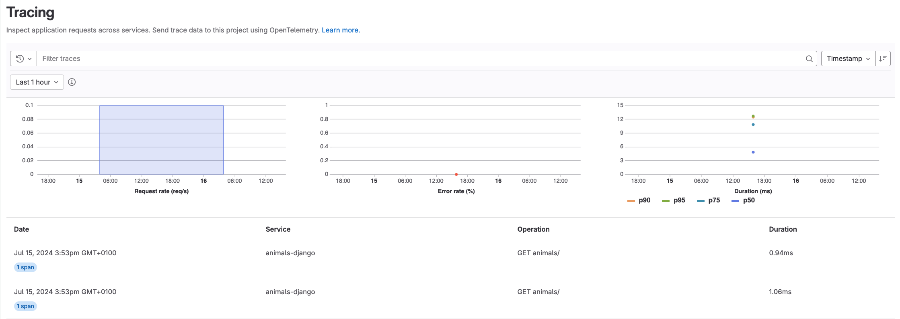



The availability of this feature is controlled by a feature flag.
For more information, see the history of the [**Distributed tracing** feature](../../development/tracing.md).
<!-- Update this note when observability_features flag is removed -->



In this tutorial, we'll show you how to create, configure, instrument, and monitor a Django application using GitLab observability features.

<!-- vale gitlab_base.SentenceSpacing = NO -->
<!-- vale gitlab_base.FutureTense = NO -->

## Before you begin

To follow along this tutorial, you should have:

- A GitLab Ultimate subscription for GitLab.com or GitLab Self-Managed
- A local installation of Python 3 and Django (You can install it with `python -m pip install Django`.)
- Basic knowledge of Git and Python
- Basic knowledge of the core concepts of [OpenTelemetry](https://opentelemetry.io/)

## Create a GitLab project

First, create a GitLab project and a corresponding access token.
This tutorial uses the project name `animals`.

1. On the left sidebar, at the top, select **Create new** () and **New project/repository**.
1. Select **Create blank project**.
1. Enter the project details.
   - In the **Project name** field, enter `animals`.
1. Select **Create project**.
1. In the `animals` project, on the left sidebar, select **Settings > Access tokens**.
1. Create an access token with the `api` scope and Developer role. Store the token value somewhere safe because you need it later.

## Create a Django application

To create an application:

1. From the command line, run the command:

   ```shell
   python -m django startproject animals_app
   ```

1. Check that the Django server is running correctly:

   ```shell
   python manage.py runserver
   ```

1. Ensure that the server is running correctly by visiting `http://localhost:8000`.
1. A Django projects contains multiple applications within a project. To create an application to manage our list of fake animals, run the command:

   ```shell
   python manage.py startapp animals
   ```

1. To create the initial view for the new `animals` application, in the `animals/views.py` file add the following code:

   ```python
   from django.http import HttpResponse

   def index(request):
       return HttpResponse("This is where the list of animals will be shown.")
   ```

1. In `animals/urls.py`, add the following code:

   ```python
   from django.urls import path
   from . import views

   urlpatterns = [
       path('', views.index, name='index'),
   ]
   ```

1. Additionally, update the room `urls.py` to include the `animals` app:

   ```python
   path('animals/', include('animals.urls'))
   ```

1. In `animals_app/settings.py`, add the application:

   ```python
   INSTALLED_APPS = [
       ...
       'animals.apps.AnimalsConfig',
   ]
   ```

1. In `animals/models.py`, create a model to define an animal:

   ```python
   from django.db import models
   class Animal(models.Model):
       name = models.CharField(max_length=200)
       number_of_legs = models.IntegerField(default=2)
       dangerous = models.BooleanField(default=False)
   ```

1. With the model defined, create a database migration. This will create a file that describes the changes to the database.

   ```shell
   python manage.py makemigrations animals
   ```

1. Run the newly created migration:

   ```shell
   python manage.py migrate
   ```

## Instrument the application with OpenTelemetry

1. Install the required dependencies:

   ```shell
   pip install opentelemetry-api opentelemetry-sdk opentelemetry-exporter-otlp-proto-http
   ```

1. Metrics and traces require different imports. In the `manage.py` file, import the required modules:

   ```python
   from opentelemetry.instrumentation.django import DjangoInstrumentor

   from opentelemetry.sdk.resources import SERVICE_NAME, Resource

   from opentelemetry import trace
   from opentelemetry.exporter.otlp.proto.http.trace_exporter import OTLPSpanExporter
   from opentelemetry.sdk.trace import TracerProvider
   from opentelemetry.sdk.trace.export import BatchSpanProcessor

   from opentelemetry import metrics
   from opentelemetry.exporter.otlp.proto.http.metric_exporter import OTLPMetricExporter
   from opentelemetry.sdk.metrics import MeterProvider
   from opentelemetry.sdk.metrics.export import PeriodicExportingMetricReader, ConsoleMetricExporter
   ```

1. To instrument the application, in the `manage.py` file, add the following code.
   - Replace `{{PROJECT_ACCESS_TOKEN}}` and `{{PROJECT_ID}}` with the values from your project.
   - If you're using GitLab Self-Managed, replace `gitlab.com` with your GitLab Self-Managed instance hostname.

   ```python
   resource = Resource(attributes={
       SERVICE_NAME: "animals-django"
   })
   os.environ.setdefault('OTEL_EXPORTER_OTLP_HEADERS', "PRIVATE-TOKEN={{PROJECT_ACCESS_TOKEN}}")
   traceProvider = TracerProvider(resource=resource)
   processor = BatchSpanProcessor(OTLPSpanExporter(endpoint="https://gitlab.com/api/v4/projects/{{PROJECT_ID}}/observability/v1/traces"))
   traceProvider.add_span_processor(processor)
   trace.set_tracer_provider(traceProvider)

   reader = PeriodicExportingMetricReader(
       OTLPMetricExporter(endpoint="https://gitlab.com/api/v4/projects/{{PROJECT_ID}}/observability/v1/metrics")
   )
   meterProvider = MeterProvider(resource=resource, metric_readers=[reader])
   metrics.set_meter_provider(meterProvider)
   meter = metrics.get_meter("default.meter")

   """Run administrative tasks."""
   os.environ.setdefault('DJANGO_SETTINGS_MODULE', 'animals_app.settings')
   DjangoInstrumentor().instrument()
   ```

  This code defines the service name `animals-django`, authenticates with GitLab, and instruments the application.

1. To start collecting traces, restart the Django server. After refreshing `/animals` a few times, you should see traces in the GitLab UI.

   

1. Optional. Django will also export certain metrics by default to GitLab, but custom metrics are supported too. For example, to increment a counter metric every time a page is loaded, add the following code:

   ```python
   meter = metrics.get_meter("default.meter")
    work_counter = meter.create_counter(
        "animals.viewed.counter", unit="1", description="Counts the number of times the list of animals was viewed"
    )

    work_counter.add(1)
   ```

  

<!-- vale gitlab_base.SentenceSpacing = YES -->
